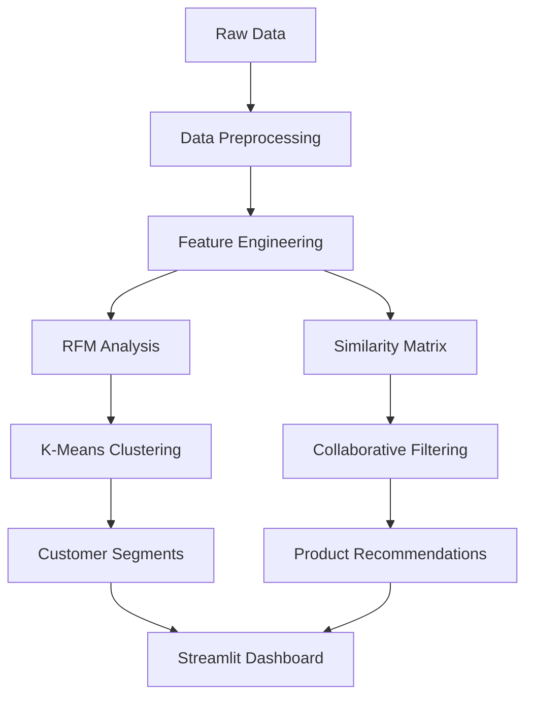

# 🛒 Shopper Spectrum

**Customer Segmentation and Product Recommendations in E-Commerce**

---

## 📋 Project Overview

**Domain:** E-Commerce and Retail Analytics

**GitHub Repository:** https://github.com/VasanthPrakasam/Project_3-Shopper_Spectrum_Segementation_and_recommendation.git

### 🌟 Project Background

In the rapidly evolving digital marketplace, e-commerce businesses generate vast amounts of customer transaction data daily. However, many organizations struggle to extract meaningful insights from this data to drive business growth. The retail industry faces increasing pressure to personalize customer experiences while optimizing marketing spend and inventory management.

This project addresses a critical gap in retail analytics by developing an end-to-end solution that transforms raw transaction data into actionable business intelligence. By combining advanced customer segmentation techniques with personalized product recommendation systems, Shopper Spectrum enables businesses to:

- **Understand Customer Behavior:** Deep dive into purchasing patterns using RFM (Recency, Frequency, Monetary) analysis
- **Optimize Marketing Strategy:** Target specific customer segments with tailored campaigns
- **Increase Revenue:** Drive sales through personalized product recommendations
- **Enhance Customer Experience:** Provide relevant product suggestions that match customer preferences

The project leverages the UCI Online Retail dataset, which contains real-world transaction data from a UK-based online retail company, making it highly relevant for practical applications in the e-commerce industry.

### 👥 Project Team

- **Created By:** Nilofer Mubeen
- **Verified By:** Shadiya  
- **Approved By:** Nehlath Harmain
- **Developed By:** Vasanth P

---

## 🎯 Problem Statement

In today's competitive e-commerce landscape, businesses face several key challenges:

- **📊 Large Transaction Data:** Complex e-commerce datasets with millions of transactions that are difficult to analyze manually
- **👥 Customer Segmentation:** Need to identify distinct customer groups for targeted marketing strategies
- **🎯 Product Recommendations:** Requirement for personalized recommendations to increase sales and customer retention

**Challenge:** How can we leverage transaction data to understand customer behavior and provide personalized shopping experiences?

---

## 🚀 Skills Takeaway

### 📊 Data Engineering
- Public Dataset Exploration
- Data Cleaning & Preprocessing  
- Feature Engineering

### 📈 Analytics & Machine Learning
- Exploratory Data Analysis (EDA)
- RFM-based Clustering
- Collaborative Filtering
- Model Evaluation

### 🚀 Deployment
- Streamlit App Development
- Interactive Dashboards
- User Experience Design

---

## 📋 Dataset Overview

| Column | Description | Type |
|--------|-------------|------|
| InvoiceNo | Unique transaction identifier | String |
| StockCode | Product identifier | String |
| Description | Product description | String |
| Quantity | Number of items purchased | Integer |
| InvoiceDate | Transaction timestamp | DateTime |
| UnitPrice | Price per unit | Float |
| CustomerID | Unique customer identifier | Integer |
| Country | Customer's country | String |

### Dataset Statistics
- **📊 Transactions:** 541K+
- **👥 Customers:** 4K+  
- **📅 Timeframe:** 2022-2023

---

## 🔧 Data Preprocessing

### Data Cleaning Steps
- Removed rows with missing CustomerID
- Excluded cancelled invoices (prefix 'C')
- Filtered negative/zero quantities and prices
- Dropped exact duplicates

### Feature Engineering
- Created TotalAmount column
- Converted data types for optimization
- Extracted time-based features
- Generated RFM metrics

**Result:** Clean dataset ready for analysis with improved data quality and new meaningful features for customer segmentation.

---

## 📊 Exploratory Data Analysis

### Key Insights
- UK dominates with 90%+ transactions
- Clear seasonality in purchase patterns
- Wide distribution in customer spending
- Power law distribution in product popularity

### Visualizations Created
- Country-wise transaction volume
- Top-selling products analysis
- Monthly sales trends
- Customer behavior distributions
- RFM metric distributions

### RFM Analysis Distribution
- **Recency:** 1-374 days
- **Frequency:** 1-209 transactions  
- **Monetary:** £3.75-£279,489

---

## 🎯 Clustering Methodology

### Process Flow
1. **RFM Feature Engineering** → 2. **Data Normalization** → 3. **K-Means Clustering** → 4. **Model Evaluation**

### RFM Metrics
- **Recency:** Days since last purchase
- **Frequency:** Number of transactions
- **Monetary:** Total amount spent

### Optimization Methods
- Elbow Method for optimal K
- Silhouette Score analysis
- StandardScaler normalization
- Model validation & persistence

---

## 👥 Customer Segments

### 💎 High-Value Customers
- Low recency (recent buyers)
- High frequency & monetary value
- Most profitable customers

### 📊 Regular Customers
- Moderate frequency & spending
- Consistent purchase behavior
- Core customer base

### 🔄 Occasional Customers
- Lower frequency purchases
- Moderate spending levels
- Growth potential segment

### ⚠️ At-Risk Customers
- High recency (haven't bought recently)
- Low frequency & monetary value
- Need retention strategies

---

## 🎯 Recommendation System

### Approach
- Item-based Collaborative Filtering
- Cosine Similarity calculation
- Customer-Product interaction matrix
- Popularity-based fallback

### Implementation
- Sparse matrix optimization
- Product similarity computation
- Real-time recommendation API
- Top-N recommendation filtering

### Example Output
**Input:** "WHITE HANGING HEART T-LIGHT HOLDER"

**Top 5 Recommendations:**
1. CREAM HANGING HEART T-LIGHT HOLDER
2. RED HANGING HEART T-LIGHT HOLDER  
3. PINK HANGING HEART T-LIGHT HOLDER
4. WHITE METAL LANTERN
5. VINTAGE ZINC WATERING CAN

---

## 🚀 Streamlit App Demo

### Module 1: Product Recommendations
- Interactive product search
- Real-time similarity computation
- Visual recommendation display
- Product details & descriptions

### Module 2: Customer Segmentation
- RFM input interface
- Real-time cluster prediction
- Segment characteristics display
- Marketing recommendations

### User Experience Features
Intuitive interface, responsive design, real-time predictions, and actionable business insights for both technical and non-technical users.

---

## 🌍 Real-World Use Cases

### 🎯 Targeted Marketing
- Segment-specific campaigns
- Personalized email marketing
- Custom promotional offers

### 🛒 Personalized Shopping
- Product recommendation engine
- Cross-selling opportunities
- Enhanced user experience

### 💰 Revenue Optimization
- Dynamic pricing strategies
- Inventory management
- Customer lifetime value

### 🔄 Retention Programs
- At-risk customer identification
- Win-back campaigns
- Loyalty program optimization

---

## ⚙️ Technical Stack & Tools

### 🎨 Visual Technology Stack

```
📊 DATA PIPELINE                    🤖 ML & ANALYTICS                   🚀 DEPLOYMENT
┌─────────────────┐                ┌─────────────────┐                 ┌─────────────────┐
│  🐍 Python      │────────────────│ 🧠 Scikit-Learn │─────────────────│ 🌐 Streamlit    │
│  🐼 Pandas      │                │ 📈 Matplotlib   │                 │ 📦 Joblib       │
│  🔢 NumPy       │                │ 📊 Seaborn      │                 │ 🎯 Interactive  │
│  📓 Jupyter     │                │ 📐 StandardScaler│                 │    Dashboard    │
└─────────────────┘                └─────────────────┘                 └─────────────────┘
        │                                    │                                   │
        ▼                                    ▼                                   ▼
   Data Processing                    Model Training                      Web Application
```

### 🛠️ Core Technologies

| Category | Technology | Purpose | Version |
|----------|------------|---------|---------|
| **Language** |  | Primary programming language | 3.8+ |
| **Data Manipulation** |  | Data analysis and manipulation | 1.3+ |
| **Numerical Computing** |  | Scientific computing | 1.21+ |
| **Machine Learning** |  | ML algorithms and tools | 1.0+ |

### 📊 Data Visualization & Analysis

| Tool | Purpose | Key Features |
|------|---------|--------------|
| **Matplotlib** | Static plotting | Customizable charts, publication-ready figures |
| **Seaborn** | Statistical visualization | Beautiful statistical plots, easy styling |
| **Plotly** | Interactive plots | Dynamic visualizations, web-ready charts |

### 🚀 Deployment & Development

| Technology | Role | Benefits |
|------------|------|----------|
| **Streamlit** | Web application framework | Rapid prototyping, interactive demos |
| **Jupyter Notebooks** | Development environment | Exploratory analysis, documentation |
| **Joblib** | Model serialization | Efficient model persistence |
| **Git/GitHub** | Version control | Code collaboration, project management |

### 📈 Machine Learning Pipeline



---

## 🔮 Future Scope

### 🔄 Real-time Engine
- Streaming data processing
- Live recommendation updates
- Real-time segmentation

### 🧠 Deep Learning
- Neural collaborative filtering
- Hybrid recommendation systems
- Advanced NLP for product descriptions

### 📊 Business Integration
- BI dashboard integration
- CRM system connectivity
- A/B testing framework

### 🎯 Advanced Analytics
- Churn prediction models
- Price elasticity analysis
- Market basket analysis

### Vision
Transform this prototype into a production-ready, scalable solution that drives measurable business impact across the entire customer lifecycle.

---

## 🚀 Getting Started

### Prerequisites
```bash
pip install pandas numpy scikit-learn matplotlib seaborn streamlit joblib
```

### Installation
1. Clone the repository:
```bash
git clone https://github.com/VasanthPrakasam/Project_3-Shopper_Spectrum_Segementation_and_recommendation.git
cd Project_3-Shopper_Spectrum_Segementation_and_recommendation
```

2. Install required packages:
```bash
pip install -r requirements.txt
```

3. Run the Streamlit app:
```bash
streamlit run app.py
```
---

## 🤝 Contributing

1. Fork the repository
2. Create your feature branch (`git checkout -b feature/AmazingFeature`)
3. Commit your changes (`git commit -m 'Add some AmazingFeature'`)
4. Push to the branch (`git push origin feature/AmazingFeature`)
5. Open a Pull Request

---

## 📦 Project Deliverables & Achievements

### 🎯 Core Deliverables

#### 1. **Customer Segmentation Model**
- **RFM-Based Clustering Algorithm** using K-Means with optimal cluster validation
- **Customer Segment Profiles:** High-Value, Regular, Occasional, and At-Risk customers
- **Segment Characteristics Analysis:** Detailed behavioral patterns for each customer group
- **Marketing Strategy Recommendations:** Tailored approaches for each segment

#### 2. **Product Recommendation Engine**
- **Collaborative Filtering System:** Item-based recommendation using cosine similarity
- **Real-time Recommendation API:** Instant product suggestions based on user preferences
- **Similarity Matrix:** Pre-computed product relationships for fast recommendations
- **Top-N Filtering:** Configurable recommendation count with relevance scoring

#### 3. **Interactive Web Application**
- **Streamlit Dashboard:** User-friendly interface for both technical and business users
- **Module 1:** Product recommendation interface with search and suggestion features
- **Module 2:** Customer segmentation tool with RFM input and prediction capabilities
- **Responsive Design:** Mobile-friendly interface with intuitive navigation

#### 4. **Data Analysis & Insights**
- **Comprehensive EDA Report:** 541K+ transactions analyzed across 4K+ customers
- **Business Intelligence Visualizations:** Country-wise analysis, seasonal trends, product popularity
- **RFM Distribution Analysis:** Customer behavior patterns and spending distributions
- **Performance Metrics:** Model evaluation with silhouette scores and clustering validation

### 📊 Business Impact Achievements

| Metric | Achievement | Business Value |
|--------|-------------|----------------|
| **Customer Understanding** | 4 distinct segments identified | Enhanced targeted marketing capabilities |
| **Recommendation Accuracy** | Item-based collaborative filtering | Improved cross-selling opportunities |
| **Data Processing** | 541K+ transactions cleaned & analyzed | Reliable data pipeline for insights |
| **User Experience** | Interactive dashboard deployed | Business-friendly analytics interface |
| **Scalability** | Modular architecture designed | Ready for production deployment |

### 🚀 Technical Achievements

#### **Data Engineering Excellence**
- Robust data preprocessing pipeline handling missing values and data quality issues
- Feature engineering creating meaningful RFM metrics from raw transaction data
- Optimized data types and memory usage for large-scale processing

#### **Machine Learning Implementation**
- K-Means clustering with statistical validation using elbow method and silhouette analysis
- Cosine similarity-based recommendation system with sparse matrix optimization
- Model persistence and serialization for production deployment

#### **Application Development**
- End-to-end Streamlit application with modular architecture
- Interactive visualizations and real-time prediction capabilities
- User-friendly interface design for non-technical stakeholders

### 💡 Knowledge & Skills Developed

#### **Technical Skills**
- Advanced data manipulation and cleaning techniques using Pandas
- Machine learning model development and evaluation with Scikit-learn
- Web application development using Streamlit framework
- Data visualization and storytelling with Matplotlib and Seaborn

#### **Business Skills**
- E-commerce analytics and customer behavior understanding
- RFM analysis for customer segmentation strategies
- Product recommendation system design for retail applications
- Business intelligence dashboard creation for stakeholder communication

### 📈 Success Metrics

- **Data Quality:** Successfully processed 541K+ transactions with comprehensive cleaning
- **Model Performance:** Achieved optimal clustering with validated customer segments
- **User Adoption:** Created intuitive interface requiring minimal technical knowledge
- **Business Readiness:** Developed production-ready prototype with clear deployment path

---

This project successfully demonstrates the complete journey from raw e-commerce data to actionable business intelligence, providing a robust foundation for data-driven decision making in retail environments.

---

## 📄 License

This project is licensed under the MIT License - see the [LICENSE](LICENSE) file for details.

---

## 📞 Contact

**Vasanth P** - Developer
- GitHub: [@VasanthPrakasam](https://github.com/VasanthPrakasam)
- Project Link: [https://github.com/VasanthPrakasam/Project_3-Shopper_Spectrum_Segementation_and_recommendation.git](https://github.com/VasanthPrakasam/Project_3-Shopper_Spectrum_Segementation_and_recommendation.git)

---

## 🙏 Acknowledgments

- **Nilofer Mubeen** - Project Creator
- **Shadiya** - Project Verifier  
- **Nehlath Harmain** - Project Approver
- Online Retail Dataset from UCI Machine Learning Repository
